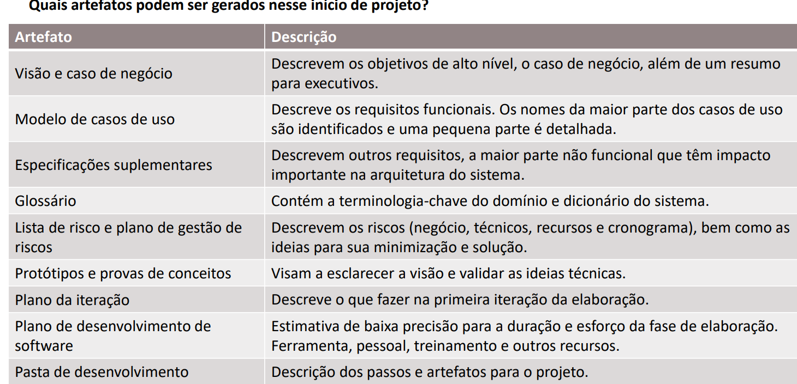

# 📝Concepção

---
## 💼 Visão e Caso de Negócio
<div align="justify">
O projeto visa auxiliar analfabetos funcionais na interpretação de contratos com o intuito de evitar com que caiam em golpes. 
</div>

---
| Seção | Conteúdo Principal |
| :--- | :--- |
| **Problema ou Oportunidade** | Prevenir que usuários sofram prejuízos financeiros ou contratuais causados pela dificuldade de compreensão de cláusulas e termos jurídicos. |
| **Análise de Alternativas** | Acesso direto via web (QR Code): descartado por riscos de infraestrutura, especificamente o consumo excessivo de recursos e a alta latência na transmissão de dados/mídia e no tempo de resposta do agente de IA |
| **Custos e Recursos** | O projeto contará com uma equipe dedicada de 3 pessoas para o desenvolvimento. O Figma será adotado como ferramenta principal para o design da interface do usuário (UI) e experiência do usuário (UX).|
| **Benefícios Esperados** | Redução do índice de fraudes e prejuízos contratuais, proporcionando maior previsibilidade, autonomia e segurança jurídica para o usuário. |
| **Riscos** | Tratamento indevido de dados sensíveis/pessoais (LGPD); Qualidade ruim dos documentos; Baixa confiança do usuário na ferramenta. |
| **Mitigação** | Anonimizar dados automaticamente antes de enviar à API e exclusão imediata; implementar um validador de imagem no app via OCR; interface intuitiva com alertas visuais por níveis de risco com linguagem acessível.|

## ⫶☰ Glossário
### Termos técnicos e de IA
- IA: Inteligência Artificial
- Latência: Tempo de resposta entre envio da requisição e resposta da IA.
- OCR (Optical Character Recognition): Tecnologia de reconhecimento óptico de caracteres usada para converter fotos ou arquivos PDF digitalizados de contratos em texto editável e legível por máquina

### Termos do domínio Jurídico/Contratual
-   LGPD(Lei Geral de Proteção de Dados): Legislação brasileira que regula o tratamento e privacidade de dados pessoais físicss e digitais.    

## 📜 Lista de riscos + plano de Gestão dos riscos
### RISCOS
* **R1 - Leitura Imprecisa do OCR:** Qualidade ruim da imagem (foto escura, desfocada ou cortada) resultando em extração incorreta de cláusulas.
* **R2 - Ambiguidade e Erro de Categorização:** Documentos curtos ou incompletos levando a IA a classificar o contrato na categoria errada.
* **R3 - Fritura de Experiência (Perguntas Repetitivas):** O assistente solicitar repetidamente dados do usuário que já foram informados em interações anteriores.
* **R4 - Sensibilidade de Dados (LGPD):** Vazamento ou retenção indevida de dados pessoais e financeiros extraídos do documento ou digitados no chat. 

### GESTÃO DOS RISCOS
| ID | Ação de Mitigação (Prevenção) | Plano de Contingência (Tratamento) |
| :--- | :--- | :--- |
| R1 | Validador visual no aplicativo que exige confirmação de nitidez do usuário (RU03) antes do processamento. | Exibir alerta de baixa legibilidade e solicitar nova captura focada na página relevante. |
| R2 | Algoritmo de onboarding com diálogo guiado: a IA faz 1 ou 2 perguntas diretas de múltipla escolha para definir o tipo de contrato. | Permitir que o usuário altere manualmente a categoria do documento no painel. |
| R3 | Implementação de estrutura de dados local/banco temporário para persistir contexto de sessão e preferências do perfil. | Oferecer atalho "Usar dados salvos no meu perfil" nas interações da IA. |
| R4 | Anonimização automática de nomes e documentos (CPF/RG) antes de enviar o texto às APIs de IA. | Permitir limpeza instantânea de histórico e exclusão completa dos dados salvos no app (RC02). |

## 🛠️ Protótipos e provas de conceitos


## 💡 Plano de iteração
1. Upload de `Contrato`
2. Validação da captura ()
3. Extração de texto (OCR)
4. Exibição do conteúdo extraído, validando se a captura funciona de forma confiável antes de integrar a camada de IA. // Colocar em bullet points

## 🛠️ Plano de desenvolvimento de software
### 1. ⚡ Metodologia de Desenvolvimento
* **Processo:** Metodologia Ágil adaptada (Scrum/Kanban).
* **Ciclos de Entrega:** Sprints semanais com Dailies para acompanhamento.
* **Quadro de Tarefas:** Gestão visual das demandas via Trello e Issues do Github.

---

### 2. 💻 Stack Tecnológica Selecionada
* **Frontend:** Web Mobile-First (React / Next.js).
* **Backend:** API REST (Node.js/Express ou Python/FastAPI) para chamadas.
* **Serviços de OCR e IA:**
    * **OCR:** Tesseract.js.
    * **IA/LLM:** API da OpenAI (GPT-4o) ou Google Gemini para simplificação e Chat Q&A.
    * **Voz:** Web Speech API (Text-to-Speech e Speech-to-Text).
* **Banco de Dados:** PostgreSQL para gestão de contas e histórico de análises.

---

### 3. 🔄 Versionamento e Práticas de Código
* **Controle de Versão:** Git e GitHub.
* **Estratégia de Branches:** GitFlow simplificado.
    * `main`: Código estável e pronto para produção.
    * `math`, `andre` e `naoto` para alterações individuais e checagem antes de dar o commit.
* **Revisão de Código:** Criação de Pull Requests (PRs) obrigatórios antes de integrar código à branch principal.

---

### 4. 🚀 Publicação e Deploy (CI/CD)
* **Hospedagem do Frontend:** 
* **Hospedagem do Backend:** 
* **Segurança na Publicação:** 

---

### 5. 🧪 Estratégia de Garantia de Qualidade (QA)
* **Testes de OCR:** Validação do percentual de acerto do texto extraído com fotos em diferentes iluminações.
* **Testes de Usabilidade:** Validação das interfaces por usuários com o perfil das personas para checar facilidade de navegação e clareza do áudio.
* **Tratamento de Erros:** Exibição de mensagens orientativas e amigáveis ao usuário caso ocorram falhas de conexão ou leitura.


## 📂 Pasta de desenvolvimento

```text
/
├── 📁 Concepção/
│   ├── DesignThinking.md              # Etapas de empatia, ideação e prototipação
│   ├── Requirements.md                # Levantamento de Requisitos (RF, RNF, RU, RC, RD, RS)
│   ├── UseCases.uml                   # Modelagem visual dos Casos de Uso
│   ├── UseCasesExplicacao.md          # Especificação detalhada dos Casos de Uso
│   ├── Visao_e_CasoDeNegocio.md       # Visão, Riscos, Glossário, PDS e Iterações
│   └── WireFrame.md                   # Guias de interface e links do Figma
│
├── 📁 Jornadas/
│   ├── jornada1.md                    # Jornada da Marta da Silva
│   ├── jornada2.md                    # Jornada do Gabriel Ouvirstappen
│   └── jornada3.md                    # Jornada do Pedrinho Akira
│
├── 📁 Modelo_Conceitual/
│   ├── Atividade.md                   # Análise GOMS das tarefas
│   ├── Proposicoes.md                 # Proposições genéricas e específicas por persona
│   └── Questionamentos_Sistematicos.md # Matriz de questionamentos de usabilidade (Q1-Q6)
│
├── 📁 Personas/
│   ├── persona1.md                    # Perfil da Marta da Silva
│   ├── persona2.md                    # Perfil do Gabriel Ouvirstappen
│   └── persona3.md                    # Perfil do Pedrinho Akira
│
└── README.md                          # Visão geral do repositório e guia do projeto
